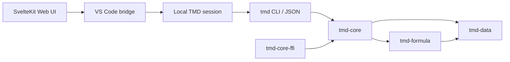

# Architecture

Tanu Markdown separates reusable data and Formula semantics, TMD document
integration, and delivery surfaces so the Rust workspace remains the single
source of truth for implemented behavior.

## Component relationships

`tmd-formula` depends only on `tmd-data`. `tmd-core` depends on both crates and
owns their integration with TMD documents. `tmd-cli` and `tmd-core-ffi` depend
on `tmd-core`. The VS Code extension calls the bundled or explicitly configured
`tmd` binary through its schema-versioned JSON bridge and never parses `.tmd`
containers in TypeScript. Preview requests send the current unsaved Markdown
with retained document bytes so the Rust renderer can query the embedded
database and resolve attachments.

## `tmd-data`

The data crate owns transport-neutral `DataScalar` and `DataTable` types. It
does not know about TMD documents, manifests, SQLite, rendering, or Formula
syntax. `tmd-core` re-exports these types to preserve its existing public API.

## `tmd-formula`

The Formula crate owns the bounded language engine:

- tokenization, parsing, and the opaque compiled program representation;
- A1, range, header, and dependency semantics;
- built-in functions and typed evaluation;
- Formula-specific safety limits and caller-supplied table-size limits; and
- structured errors with spreadsheet codes, source locations, and target
  cells.

The engine accepts and returns `tmd-data` tables. It has no dependency on TMD
containers, manifests, SQLite, rendering, the CLI, or editor code. A future
source-preserving cell-editing model or WASM adapter can therefore build on the
same language semantics without depending on `tmd-core`.

## `tmd-core`

The core crate owns:

- `TmdDoc`, `Manifest`, and attachment metadata;
- logical attachment path normalization and SHA-256 validation;
- embedded SQLite lifecycle and migration helpers;
- named dynamic-data registry parsing, SQLite-independent managed Formula table
  evaluation, sandboxed Rhai transformation, legacy query/computed Formula
  resolution, and adaptation between document data sources and the standalone
  Formula engine;
- `.tmd` ZIP serialization;
- optional C ABI functions behind the `ffi` feature.

The crate currently keeps attachment and complete-container data in memory
during I/O. Public read/write modes expose only implemented hash-verification
and hash-recomputation choices.

## `tmd-cli`

The CLI translates terminal inputs into `tmd-core` operations. It owns:

- argument parsing and exit errors;
- `.tmd` path validation;
- human-readable and schema-versioned JSON inspection/updates;
- attachment and SQLite lifecycle UX;
- Markdown-to-HTML and schema-versioned preview rendering with real `attach:`
  URL rewriting and dynamic managed Formula, Rhai, and legacy Formula views.

HTML rendering neutralizes raw markup and executable URL schemes. Self-contained
exports retain passive raster-image and plain-text MIME types and downgrade
other attachment data URIs to `application/octet-stream`. Linked exports use
flat UUID-based filenames, download-only attachment links, and passive inline
image sources. File-format validation belongs in `tmd-core`, not in CLI-only
code.

## `tmd-core-ffi`

The FFI crate produces the dynamic library and retains the symbols implemented
by the `tmd-core` `ffi` feature. It does not currently define a generated header,
ABI version negotiation, or cross-language packaging policy.

## `tmd-vscode`

The editor is divided into three responsibilities:

- a statically generated SvelteKit Web UI owns controls, layout, local
  presentation state, and input/response ordering;
- the VS Code bridge owns custom-editor lifecycle, commands, undo/redo events,
  dialogs, and typed messages between VS Code and the editing surface; and
- `LocalTmdSession` owns one opened document's draft, revisions, retained
  container bytes, operation serialization, and calls to the Rust CLI.

The Web UI uses `adapter-static`, builds as separate JavaScript and CSS assets,
and contains no TMD container parser. The VS Code bridge rewrites the generated
asset URLs to webview resource URIs and injects a per-panel CSP nonce. A browser
host can provide the same small host adapter instead of the VS Code API. The
current local session invokes the existing one-shot CLI JSON operations, so
terminal commands and editor use coexist. A future persistent stdio or remote
collaborative session can sit behind the host bridge without moving document
authority into the editing surface. The table tab asks the session to evaluate
a selected named source through the versioned `data-source` CLI bridge and
renders the typed result in a bundled RevoGrid. For Rhai sources,
the session also reads the referenced UTF-8 attachment through the CLI and the
table tab displays a CodeMirror editor with a small Rhai lexer. Script drafts
are document edits, while preview and table evaluation receive them as bounded
in-memory attachment overrides. Debounced evaluation failures are translated
to CodeMirror lint diagnostics when the Rhai runtime reports a source
location. Managed Formula rows, columns, typed literals, constraints, and
per-cell expressions are stored inline in schema-version-6 source definitions;
schema version 8 adds visible identity columns, self-contained cross-table
`REF` evaluation, and unlockable reference-group editing constraints. Schema
version 7 hidden relationships remain readable for compatibility.
Their edits flow immediately through the ordinary source-definition
dirty/save/backup/undo lifecycle; table reevaluation is debounced, and the
CLI/core returns typed Formula diagnostics. The editor uses stable row and
column identities for structure edits and rewrites position-based A1 references
when inserting data. Range extraction and normalization update source
definitions atomically; normalization retains the original visible columns as
direct `REF` formulas, adds a visible identity to the extracted table, and
protects the linked range with a releasable reference group.
Query-backed and computed Formula modes keep their
previous SQLite staging path for compatibility but are not created by the
current editor.

Platform-specific VSIX packages carry the matching native CLI. A machine-level
setting may select an external CLI, while generic development packages fall
back to `PATH`. The extension invokes the selected CLI with argument arrays and
no shell. The webview uses a restrictive content security policy, bundled
styles and scripts, DOM text APIs, and escaped preview HTML. Edit state is sent
immediately so closing a panel cannot strand input; only preview rendering is
debounced. Commands remain bound to their originating document across
asynchronous work, and all document I/O runs through the session's
per-document serial queue. The current editor supports local files only.

## Repository-level contracts

- The root Cargo workspace and `Cargo.lock` define one Rust dependency graph.
- `rust-toolchain.toml` and `Dockerfile` define supported toolchains.
- `justfile` and `.github/workflows/ci.yml` define equivalent local and CI
  checks.
- `docs/spec-tmd-1.0-draft.md` defines the versioned implemented format.
- GitHub Issues are the source of truth for future work.
